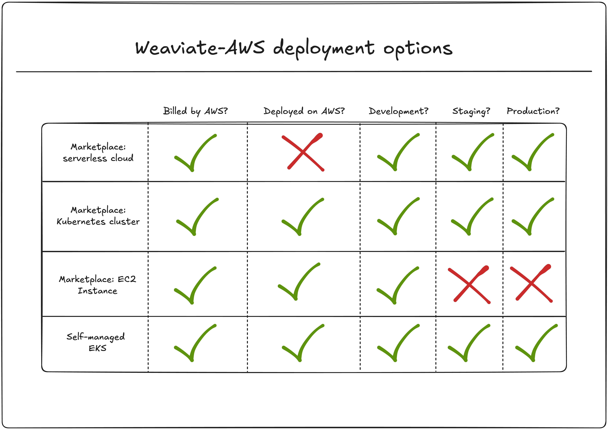

このセクションでは、Amazon Web Services ( AWS ) 上で Weaviate をデプロイして実行するための総合的なガイダンスを提供します。開発環境の構築、プロダクション環境へのデプロイ、AWS サービスとの統合など、AWS エコシステム向けに特化したインストールガイド、チュートリアル、ハウツー、リファレンス資料を確認できます。

## 本ドキュメントの内容

- **インストールガイド:** さまざまな AWS サービスを利用して Weaviate をデプロイするためのステップバイステップ手順。  
- **チュートリアル:** 一般的な AWS デプロイスキームを対象としたエンドツーエンドのウォークスルー。  
- **ハウツーガイド:** 特定の AWS 構成や統合に関するタスク指向の手順。  
- **リファレンスドキュメント:** AWS 固有の設定オプション、ベストプラクティス、トラブルシューティングガイド。  

## デプロイ方法

Weaviate は AWS 上に複数のデプロイ手段を提供しており、ユースケースや運用ニーズに応じて選択できます。

### Marketplace 提供

#### [AWS Marketplace - Serverless Cloud](../installation-guides/aws-marketplace.md)

AWS Marketplace から Weaviate Serverless Cloud をデプロイし、AWS 課金と連携した迅速なクラウドデプロイを実現します。  

この SaaS ソリューションは、次のようなニーズを持つ AWS 利用者向けです。  

- AWS 課金との統合  
- 特定リージョンでのデプロイが必要な規制要件  
- インフラ管理なしでの迅速なセットアップ  

#### [AWS Marketplace - Kubernetes クラスター](../installation-guides/eks-marketplace.md)

AWS Marketplace 経由で AWS CloudFormation テンプレートを使用し、Amazon EKS 上に Weaviate をデプロイします。これにより、単一ノードグループの EKS クラスター、ロードバランサーコントローラー、および EBS CSI ドライバーが自動的に構成されます。

#### 作成されるリソース

- 単一ノードグループを持つ EKS クラスター  
- EKS 用ロードバランサーコントローラー  
- 永続ストレージ用 AWS EBS CSI ドライバー  
- 公式 Helm チャートによる最新の選択バージョンの Weaviate  

**適した用途:** 本番環境、セットアップの複雑さを避けたいマネージド Kubernetes を求めるチーム、エンタープライズグレードのデプロイ。

#### [AWS Marketplace - EC2 インスタンス](../installation-guides/ecs-marketplace.md)

AWS Marketplace を通じ、Docker を用いて単一 EC2 インスタンス上に完全動作する Weaviate をデプロイします。このオプションも CloudFormation テンプレートを利用し、Weaviate を迅速にプロトタイプやテストしたい開発者に最適です。

#### 仕様

- 単一 EC2 インスタンス (デフォルト: m7g.medium)  
- Docker コンテナデプロイ  
- 月額契約 (AWS による即時課金)  
- テストおよび開発向け (エンタープライズサポートなし)  

### 自己管理オプション

#### [自己管理 EKS](../installation-guides/eks.md)

`eksctl` コマンドラインツールを使用して独自の EKS クラスターを作成・管理し、クラスター設定、スケーリング、管理を完全にコントロールできます。

#### 特長

- クラスター設定を完全にコントロール  
- カスタムオートスケーリングノードグループ  
- インスタンスタイプとストレージクラスの選択  
- 永続ストレージ用 AWS EBS CSI ドライバーとの統合  

**適した用途:** Kubernetes の専門知識を持つ組織、カスタムインフラ要件がある場合、最大限の柔軟性とコントロールが必要な場合。

### デプロイ比較

各デプロイオプションは管理とコントロールのレベルが異なります。

- **Serverless Cloud:** 自動スケーリングとゼロインフラ管理を備えたフルマネージド SaaS。  
- **Marketplace EKS:** CloudFormation による事前構成済みインフラを持つマネージド Kubernetes コントロールプレーン。  
- **Marketplace EC2:** 月額課金の単一インスタンス Docker デプロイで、開発に最適。  
- **自己管理 EKS:** EKS クラスターの構成および管理を完全にコントロール可能。  

## 質問とフィードバック

import DocsFeedback from '/_includes/docs-feedback.mdx';

<DocsFeedback/>

