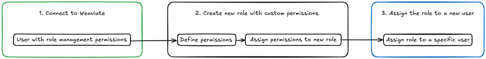

import Link from '@docusaurus/Link';
import Tabs from '@theme/Tabs';
import TabItem from '@theme/TabItem';
import FilteredTextBlock from '@site/src/components/Documentation/FilteredTextBlock';
import PyCode from '!!raw-loader!/_includes/code/python/howto.configure.rbac.permissions.py';
import TSCode from '!!raw-loader!/_includes/code/typescript/howto.configure.rbac.permissions.ts';
import RolePyCode from '!!raw-loader!/_includes/code/python/howto.configure.rbac.roles.py';
import UserPyCode from '!!raw-loader!/_includes/code/python/howto.configure.rbac.users.py';
import RoleTSCode from '!!raw-loader!/_includes/code/typescript/howto.configure.rbac.roles.ts';

**Role-Based Access Control（RBAC）** は、Weaviate インスタンスへのアクセスと変更を管理できる強力なセキュリティ メカニズムです。 このチュートリアルでは、カスタム権限を持つロールを定義し、それをユーザーに割り当てることで Weaviate で RBAC を設定する方法を学びます。これにより、データの読み書きからコレクションやテナントの管理まで、操作ごとに細かい制御を行い、許可されたユーザーだけが特定のアクションを実行できるようにします。

ここでは次の手順を取り上げます。

1. **Weaviate への接続**  
   必要なロール管理権限を持つユーザーで認証されていることを確認します。  
1. **カスタム ロールの作成**  
   読み取り、書き込み、テナント管理など、特定の権限を持つロールを定義します。  
1. **新規ユーザーへのロール割り当て**  
   作成したロールを新しいユーザーに適用し、さまざまなリソースへのアクセスを制限します。  



このガイドを終えるころには、Weaviate デプロイメントに RBAC を実装するための明確なロードマップが得られ、AI 搭載アプリケーションに不可欠なセキュリティ層を追加できます。

---

次のロールを作成します。

- **[読み取りおよび書き込み権限](#read-and-write-permissions)：** `rw_role`  
  コレクションとデータへの読み取り・書き込みアクセスを付与するカスタム ロールを作成し、それをユーザーに割り当てる方法を学びます。
- **[閲覧者権限](#viewer-permissions)：** `viewer_role`  
  特定のコレクションに対して読み取り専用アクセスに制限するロールを設定します。
- **[テナント権限](#tenant-permissions)：** `tenant_manager`  
  テナントの作成、読み取り、更新を含むテナント管理権限を持つロールを構成します。

## 前提条件

開始する前に、以下を用意してください。

- ローカル Weaviate インスタンスを実行するための Docker  
- お好みの Weaviate [クライアント ライブラリ](/weaviate/client-libraries/index.mdx)

### ローカル インスタンス - `root` ユーザー

このチュートリアルを進めるには、`root` ロールが割り当てられたユーザーで Weaviate に接続する必要があります。これにより、ロールと権限を管理できます。

Docker Compose ファイル（`docker-compose.yml`）を作成し、次の設定をコピーしてください。

:::info
この設定の環境変数は次の目的で使用されます：

- RBAC を有効化します。
- `root-user` を組み込みの root / admin 権限を持つユーザーとして設定します。
:::

```yaml
---
services:
  weaviate:
    command:
      - --host
      - 0.0.0.0
      - --port
      - '8080'
      - --scheme
      - http
    image: cr.weaviate.io/semitechnologies/weaviate:||site.weaviate_version||
    ports:
      - 8080:8080
      - 50051:50051
    volumes:
      - weaviate_data:/var/lib/weaviate
    restart: on-failure:0
    environment:
      QUERY_DEFAULTS_LIMIT: 25
      PERSISTENCE_DATA_PATH: '/var/lib/weaviate'
      ENABLE_API_BASED_MODULES: 'true'
      CLUSTER_HOSTNAME: 'node1'
      AUTHENTICATION_ANONYMOUS_ACCESS_ENABLED: 'false'
      AUTHORIZATION_ENABLE_RBAC: 'true'
      AUTHORIZATION_RBAC_ROOT_USERS: 'root-user'
      AUTHENTICATION_DB_USERS_ENABLED: 'true'
      AUTHENTICATION_APIKEY_ENABLED: 'true'
      AUTHENTICATION_APIKEY_USERS: 'root-user'
      AUTHENTICATION_APIKEY_ALLOWED_KEYS: 'root-user-key'
 
volumes:
  weaviate_data:
```
:::info
<details>
  <summary> RBAC 固有の環境変数 </summary>

- `AUTHORIZATION_ENABLE_RBAC`: RBAC を有効化します。  
- `AUTHENTICATION_ANONYMOUS_ACCESS_ENABLED`: 匿名ユーザーが Weaviate インスタンスへアクセスできるかを設定します。  
- `AUTHENTICATION_DB_USERS_ENABLED`: 実行時ユーザー管理を有効／無効にします。  
- `AUTHENTICATION_APIKEY_ENABLED`: API キーによる認証を有効化します。  
- `AUTHENTICATION_APIKEY_USERS`: `AUTHENTICATION_APIKEY_ENABLED` に対応する API キー ベースのアイデンティティです。  
- `AUTHENTICATION_APIKEY_ALLOWED_KEYS`: 許可された API キーで、特定のユーザー アイデンティティに対応します。  
- `AUTHORIZATION_RBAC_ROOT_USERS`: ルート／管理者ユーザーを定義します。  

その他の環境変数については [こちら](../configuration/env-vars/index.md) を参照してください。
</details>

:::


`root-user` で Weaviate に接続し、新しいロールを作成したら `custom-user` という新しいユーザーを作成し、そのロールを割り当てます。

## 読み取りおよび書き込み権限

### Step 1: Weaviate への接続

ロールを管理する十分な権限を持つユーザーで Weaviate に接続されていることを確認してください。これは、[Weaviate の設定](/deploy/configuration/configuring-rbac.md)時にあらかじめ定義された `root` ロールを使用するか、ユーザーに [`manage_roles` 権限](/weaviate/configuration/rbac/manage-roles.mdx#role-management-permissions) を付与することで実現できます。

<Tabs groupId="languages">
  <TabItem value="py" label="Python Client v4">
    <FilteredTextBlock
      text={RolePyCode}
      startMarker="# START AdminClient"
      endMarker="# END AdminClient"
      language="py"
    />
  </TabItem>
  <TabItem value="js" label="JS/TS Client v3">
    <FilteredTextBlock
      text={RoleTSCode}
      startMarker="// START AdminClient"
      endMarker="// END AdminClient"
      language="ts"
    />
  </TabItem>
  <TabItem value="go" label="Go">

```go
// Go support coming soon
```

  </TabItem>
  <TabItem value="java" label="Java">

```java
// Java support coming soon
```

  </TabItem>
</Tabs>


### ステップ 2: カスタム権限を持つ新しいロールの作成

`TargetCollection` で始まるコレクションに対する読み取りおよび書き込み権限と、ノードおよびクラスタメタデータに対する読み取り権限を付与します。

<Tabs groupId="languages">
  <TabItem value="py" label="Python Client v4">
    <FilteredTextBlock
      text={PyCode}
      startMarker="# START ReadWritePermissionDefinition"
      endMarker="# END ReadWritePermissionDefinition"
      language="py"
    />
  </TabItem>
  <TabItem value="js" label="JS/TS Client v3">
    <FilteredTextBlock
      text={TSCode}
      startMarker="// START ReadWritePermissionDefinition"
      endMarker="// END ReadWritePermissionDefinition"
      language="ts"
    />
  </TabItem>
  <TabItem value="go" label="Go">

```go
// Go support coming soon
```

  </TabItem>
  <TabItem value="java" label="Java">

```java
// Java support coming soon
```

  </TabItem>
</Tabs>

### ステップ 3: 新しいユーザーへのロール割り当て

まず、新しいユーザー `custom-user` を作成します:

<Tabs groupId="languages">
  <TabItem value="py" label="Python Client v4">
    <FilteredTextBlock
      text={UserPyCode}
      startMarker="# START CreateUser"
      endMarker="# END CreateUser"
      language="py"
    />
  </TabItem>
  <TabItem value="js" label="JS/TS Client v3">

```ts
// TS support coming soon
```

  </TabItem>
  <TabItem value="go" label="Go">

```go
// Go support coming soon
```

  </TabItem>
  <TabItem value="java" label="Java">

```java
// Java support coming soon
```

  </TabItem>
</Tabs>

次に、ロール `rw_role` を `custom-user` に割り当てます:

<Tabs groupId="languages">
  <TabItem value="py" label="Python Client v4">
    <FilteredTextBlock
      text={PyCode}
      startMarker="# START ReadWritePermissionAssignment"
      endMarker="# END ReadWritePermissionAssignment"
      language="py"
    />
  </TabItem>
  <TabItem value="js" label="JS/TS Client v3">
    <FilteredTextBlock
      text={TSCode}
      startMarker="// START ReadWritePermissionAssignment"
      endMarker="// END ReadWritePermissionAssignment"
      language="ts"
    />
  </TabItem>
  <TabItem value="go" label="Go">

```go
// Go support coming soon
```

  </TabItem>
  <TabItem value="java" label="Java">

```java
// Java support coming soon
```

  </TabItem>
</Tabs>

## ビューアー権限

### ステップ 1: Weaviate への接続

ロールを管理するための十分な権限を持つユーザーで Weaviate に接続されていることを確認してください。  
これは、[Weaviate の設定](/deploy/configuration/configuring-rbac) 時にあらかじめ定義されている `root` ロールを使用するか、  
ユーザーに [`manage_roles` 権限](/weaviate/configuration/rbac/manage-roles#role-management) を付与することで実現できます。

<Tabs groupId="languages">
  <TabItem value="py" label="Python Client v4">
    <FilteredTextBlock
      text={RolePyCode}
      startMarker="# START AdminClient"
      endMarker="# END AdminClient"
      language="py"
    />
  </TabItem>
  <TabItem value="js" label="JS/TS Client v3">
    <FilteredTextBlock
      text={RoleTSCode}
      startMarker="// START AdminClient"
      endMarker="// END AdminClient"
      language="ts"
    />
  </TabItem>
  <TabItem value="go" label="Go">

```go
// Go support coming soon
```

  </TabItem>
  <TabItem value="java" label="Java">

```java
// Java support coming soon
```

  </TabItem>
</Tabs>


### ステップ 2: カスタム権限を持つ新しいロールの作成

これにより、`TargetCollection` で始まるコレクションに対してビューアー権限が付与されます。

<Tabs groupId="languages">
  <TabItem value="py" label="Python Client v4">
    <FilteredTextBlock
      text={PyCode}
      startMarker="# START ViewerPermissionDefinition"
      endMarker="# END ViewerPermissionDefinition"
      language="py"
    />
  </TabItem>
  <TabItem value="js" label="JS/TS Client v3">
    <FilteredTextBlock
      text={TSCode}
      startMarker="// START ViewerPermissionDefinition"
      endMarker="// END ViewerPermissionDefinition"
      language="ts"
    />
  </TabItem>
  <TabItem value="go" label="Go">

```go
// Go support coming soon
```

  </TabItem>
  <TabItem value="java" label="Java">

```java
// Java support coming soon
```

  </TabItem>
</Tabs>

### ステップ 3: 新しいユーザーへのロールの割り当て

まず、新しいユーザー `custom-user` を作成します:

<Tabs groupId="languages">
  <TabItem value="py" label="Python Client v4">
    <FilteredTextBlock
      text={UserPyCode}
      startMarker="# START CreateUser"
      endMarker="# END CreateUser"
      language="py"
    />
  </TabItem>
  <TabItem value="js" label="JS/TS Client v3">

```ts
// TS support coming soon
```

  </TabItem>
  <TabItem value="go" label="Go">

```go
// Go support coming soon
```

  </TabItem>
  <TabItem value="java" label="Java">

```java
// Java support coming soon
```

  </TabItem>
</Tabs>

次に、`custom-user` にロール `viewer_role` を割り当てます:

<Tabs groupId="languages">
  <TabItem value="py" label="Python Client v4">
    <FilteredTextBlock
      text={PyCode}
      startMarker="# START ViewerPermissionAssignment"
      endMarker="# END ViewerPermissionAssignment"
      language="py"
    />
  </TabItem>
  <TabItem value="js" label="JS/TS Client v3">
    <FilteredTextBlock
      text={TSCode}
      startMarker="// START ViewerPermissionAssignment"
      endMarker="// END ViewerPermissionAssignment"
      language="ts"
    />
  </TabItem>
  <TabItem value="go" label="Go">

```go
// Go support coming soon
```

  </TabItem>
  <TabItem value="java" label="Java">

```java
// Java support coming soon
```

  </TabItem>
</Tabs>

## テナント権限

### ステップ 1: Weaviate への接続

ロールを管理するのに十分な権限を持つユーザーで Weaviate に接続されていることを確認してください。  
これは、[Weaviate の設定](/deploy/configuration/configuring-rbac.md) 時に定義済みの `root` ロールを使用するか、  
ユーザーに [`manage_roles` パーミッション](/weaviate/configuration/rbac/manage-roles.mdx#role-management-permissions) を付与することで実現できます。

<Tabs groupId="languages">
  <TabItem value="py" label="Python Client v4">
    <FilteredTextBlock
      text={RolePyCode}
      startMarker="# START AdminClient"
      endMarker="# END AdminClient"
      language="py"
    />
  </TabItem>
  <TabItem value="js" label="JS/TS Client v3">
    <FilteredTextBlock
      text={RoleTSCode}
      startMarker="// START AdminClient"
      endMarker="// END AdminClient"
      language="ts"
    />
  </TabItem>
  <TabItem value="go" label="Go">

```go
// Go support coming soon
```

  </TabItem>
  <TabItem value="java" label="Java">

```java
// Java support coming soon
```

  </TabItem>
</Tabs>


### ステップ 2：カスタム権限付きロールの作成

これにより、以下の権限が付与されます:
- `TargetCollection` で始まるコレクション内の、`TargetTenant` で始まるテナントを完全に管理できます。
- `TargetCollection` で始まるコレクション内の、`TargetTenant` で始まるテナントに対して、データの作成・読み取り・更新・削除ができます。

<Tabs groupId="languages">
  <TabItem value="py" label="Python Client v4">
    <FilteredTextBlock
      text={PyCode}
      startMarker="# START MTPermissionsExample"
      endMarker="# END MTPermissionsExample"
      language="py"
    />
  </TabItem>
  <TabItem value="js" label="JS/TS Client v3">
    <FilteredTextBlock
      text={TSCode}
      startMarker="// START MTPermissionsExample"
      endMarker="// END MTPermissionsExample"
      language="ts"
    />
  </TabItem>
  <TabItem value="go" label="Go">

```go
// Go support coming soon
```

  </TabItem>
  <TabItem value="java" label="Java">

```java
// Java support coming soon
```

  </TabItem>
</Tabs>

### ステップ 3：新しいユーザーへのロール割り当て

まず、新しいユーザー `custom-user` を作成します:

<Tabs groupId="languages">
  <TabItem value="py" label="Python Client v4">
    <FilteredTextBlock
      text={UserPyCode}
      startMarker="# START CreateUser"
      endMarker="# END CreateUser"
      language="py"
    />
  </TabItem>
  <TabItem value="js" label="JS/TS Client v3">

```ts
// TS support coming soon
```

  </TabItem>
  <TabItem value="go" label="Go">

```go
// Go support coming soon
```

  </TabItem>
  <TabItem value="java" label="Java">

```java
// Java support coming soon
```

  </TabItem>
</Tabs>

次に、ロール `tenant_manager` を `custom-user` に割り当てます:

<Tabs groupId="languages">
  <TabItem value="py" label="Python Client v4">
    <FilteredTextBlock
      text={PyCode}
      startMarker="# START MTPermissionsAssignment"
      endMarker="# END MTPermissionsAssignment"
      language="py"
    />
  </TabItem>
  <TabItem value="js" label="JS/TS Client v3">
    <FilteredTextBlock
      text={TSCode}
      startMarker="// START MTPermissionsAssignment"
      endMarker="// END MTPermissionsAssignment"
      language="ts"
    />
  </TabItem>
  <TabItem value="go" label="Go">

```go
// Go support coming soon
```

  </TabItem>
  <TabItem value="java" label="Java">

```java
// Java support coming soon
```

  </TabItem>
</Tabs>

## 概要

このチュートリアルは、Weaviate で RBAC を設定するための包括的なガイドを提供し、カスタマイズしたロールと権限でユーザーアクセスを管理することで、ベクトルデータベースを安全に保護する方法を説明します。

ロール管理権限を持つユーザーで Weaviate に接続する方法から始まり、さまざまなアクセスレベルに合わせてカスタムロールを作成する方法を示します。コレクションとデータを管理するための読み書き権限を持つロールの設定、読み取り専用アクセス用のビューア権限の構成、テナント操作を管理するテナント権限の確立について学べます。

## 追加リソース

- [RBAC: 設定](/deploy/configuration/configuring-rbac.md)
- [RBAC: ロールの管理](/weaviate/configuration/rbac/manage-roles.mdx)
- [RBAC: ユーザーの管理](/weaviate/configuration/rbac/manage-users.mdx)

## ご質問・フィードバック

import DocsFeedback from '/_includes/docs-feedback.mdx';

<DocsFeedback />

