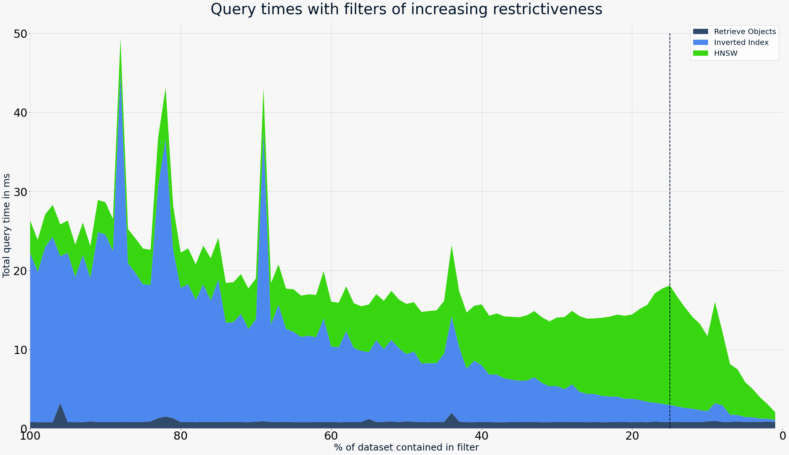

Weaviate は強力なフィルタ付き ベクトル 検索機能を提供しており、 ベクトル 検索と構造化されたスカラー フィルタを組み合わせることができます。これにより、クエリ ベクトル に最も近い ベクトル を、指定した条件に一致するものの中から見つけ出せます。

Weaviate のフィルタ付き ベクトル 検索はプリフィルタリングの概念に基づいています。これは、 ベクトル 検索を実行する前にフィルタを構築する方式です。一般的なプリフィルタリング実装とは異なり、Weaviate のプリフィルタリングではブルートフォースの ベクトル 検索は不要で、高い効率を誇ります。

`v1.27` から、Weaviate は [`ACORN`](#acorn) フィルタ戦略を実装しました。このフィルタリング手法は、特にフィルタとクエリ ベクトル の相関が低い場合の大規模データセットでパフォーマンスを大幅に向上させます。

## ポストフィルタリングとプリフィルタリング

プリフィルタリングを利用できないシステムは、一般的にポストフィルタリングに頼らざるを得ません。この方法ではまず ベクトル 検索を行い、その後フィルタに一致しない結果を除外します。これには次の 2 つの大きな欠点があります。

1. フィルタがすでに絞り込まれた候補リストに適用されるため、検索結果が何件含まれるか予測しにくい。
2. フィルタが非常に厳しい場合、すなわちデータセット全体に対してごく少数のデータポイントしか一致しない場合、元の ベクトル 検索結果に一致する要素がまったく含まれない可能性がある。

ポストフィルタリングの制限はプリフィルタリングで解消できます。プリフィルタリングとは、 ベクトル 検索を開始する前に該当候補を決定し、「許可リスト」に含まれる候補のみを検索対象とする方法です。

:::note
著者によっては「プリフィルタリング」と「シングルステージフィルタリング」を区別し、前者はブルートフォース検索を伴い後者は伴わないと定義する場合があります。本ドキュメントではこの区別を行いません。Weaviate はプリフィルタリング時にも転置インデックスと HNSW インデックスを組み合わせることでブルートフォース検索に頼る必要がないためです。
:::

## Weaviate における効率的なプリフィルタ検索

ストレージの章で [シャードを構成する要素](./storage.md) を詳しく説明しました。特に重要なのは、各シャードに転置インデックスが HNSW インデックスの隣に格納されている点です。これにより効率的なプリフィルタリングが可能になります。プロセスは以下のとおりです。

1. まず転置インデックス（従来の検索エンジンに類似）を使用して対象候補の許可リストを生成します。このリストは `uint64` の ID の集合であり、非常に大きくなっても効率を損ないません。
2. 次に ベクトル 検索を行い、この許可リストを HNSW インデックスに渡します。インデックスは通常どおりノード間のエッジを辿りますが、結果セットには許可リストに含まれる ID だけを追加します。検索の終了条件はフィルタなし検索と同じで、必要な件数に達し追加候補が結果品質を向上させなくなった時点で終了します。

## フィルタ戦略

`v1.27` 現在、Weaviate は HNSW インデックスタイプ向けに `sweeping` と `acorn` の 2 種類のフィルタ戦略をサポートしています。

### ACORN

:::info Added in `1.27`
:::

Weaviate `1.27` では、新しいフィルタリングアルゴリズムとして [`ACORN`](https://arxiv.org/html/2403.04871v1) 論文に基づく手法を追加しました。本ドキュメントではこれを `ACORN` と呼びますが、実際の実装は論文に着想を得た Weaviate 独自のものです（以降 `ACORN` という記述は Weaviate 実装を指します）。

`ACORN` アルゴリズムは、以下の方法で [HNSW インデックス](./indexing/vector-index.md#hierarchical-navigable-small-world-hnsw-index) でのフィルタ付き検索を高速化します。

- フィルタを満たさないオブジェクトを距離計算から除外。
- マルチホップ手法で候補の近傍を評価し、関連するグラフ領域へより速く到達。
- フィルタに一致する追加のエントリポイントをランダムにシードし、フィルタ領域への収束を加速。

`ACORN` アルゴリズムはフィルタとクエリ ベクトル の相関が低い場合、すなわちクエリに近いグラフ領域の多くのオブジェクトがフィルタで除外される状況で特に有用です。

社内テストでは、相関が低く制限の厳しいフィルタにおいて `ACORN` が大規模データセットで大幅な高速化を示しました。これがボトルネックとなっている場合は `ACORN` の有効化を推奨します。

`v1.27` 以降、対象の HNSW ベクトル インデックスの [コレクション設定](../manage-collections/vector-config.mdx#set-vector-index-parameters) で `filterStrategy` フィールドを設定することで `ACORN` を有効化できます。

### Sweeping

従来から存在し、現在のデフォルトとなっているフィルタ戦略は `sweeping` です。この戦略は HNSW グラフを「スイープ」する概念に基づいています。

アルゴリズムはルートノードから開始し、グラフをトラバースしながら各ノードでクエリ ベクトル との距離を評価し、同時にフィルタの許可リストを参照します。フィルタを満たさないノードはスキップし、トラバースを継続します。この処理を必要な結果数に達するまで繰り返します。

## `indexFilterable` {#indexFilterable}

:::info Added in `1.18`
:::

Weaviate `v1.18.0` では、Roaring Bitmap を用いてマッチベースフィルタを高速化する `indexFilterable` インデックスが追加されました。Roaring Bitmap はデータをチャンクに分割し、それぞれに適切なストレージ戦略を適用することで効率を高めます。これにより高いデータ圧縮率と集合演算速度が得られ、Weaviate のフィルタリングが高速化されます。

大規模データセットを扱う場合、フィルタリング性能が大幅に向上する可能性が高いため、移行と再インデックスを強く推奨します。

加えて、私たちのチームは基盤となる Roaring Bitmap ライブラリを保守し、必要に応じて問題解決や改善を行っています。

#### `text` プロパティ向けの `indexFilterable`

:::info Added in `1.19`
:::

`1.19` 以降、`text` プロパティ向けに Roaring Bitmap インデックスが利用可能になりました。これは 2 つの独立した (`filterable` と `searchable`) インデックスとして実装され、従来の単一インデックスを置き換えます。Roaring セットインデックスを作成するかを決定する `indexFilterable` と、BM25 用の Map インデックスを作成するかを決定する `indexSearchable` を設定できます（どちらもデフォルトで有効）。

#### `indexFilterable` への移行 {#migration-to-indexFilterable}

Weaviate バージョン `< 1.18.0` を利用している場合、`1.18.0` 以上へ移行し、一度だけ新しいインデックスを作成することで Roaring Bitmap を利用できます。Weaviate が Roaring Bitmap インデックスを作成すると、その後はバックグラウンドで動作し高速化を実現します。

この動作は <code>REINDEX<wbr />_SET_TO<wbr />_ROARINGSET<wbr />_AT_STARTUP</code> [環境変数](/deploy/configuration/env-vars/index.md) で制御します。再インデックスを実行したくない場合は、アップグレード前に `false` に設定してください。

:::info Read more
Weaviate の Roaring Bitmap 実装について詳しくは [インラインドキュメント](https://pkg.go.dev/github.com/weaviate/weaviate/adapters/repos/db/lsmkv/roaringset) をご覧ください。
:::

## `indexRangeFilters`

:::info Added in `1.26`
:::

Weaviate `1.26` では、数値範囲でのフィルタリング用に `indexRangeFilters` インデックスが導入されました。このインデックスは `int`、`number`、`date` プロパティに利用できます。これらのデータ型の配列には対応していません。

内部的には、レンジ可能インデックスは Roaring Bitmap スライスとして実装されており、64 ビット整数として格納可能な値に制限されます。

`indexRangeFilters` は新規プロパティでのみ利用可能で、既存プロパティを変換して使用することはできません。

## プリフィルタ検索におけるリコール

Weaviate のカスタム HNSW 実装では、HNSW グラフのリンクを通常どおり辿りつつ、結果セットを検討する際にのみフィルタ条件を適用するため、グラフの整合性が保たれます。そのためフィルタ付き検索のリコールは、通常フィルタなし検索と比べて悪化しません。

以下の図は、異なる厳しさのフィルタを適用した場合を示しています。左（データセットの 100% が一致）から右（1% が一致）へ進むにつれフィルタが厳しくなっても、`k=10`、`k=15`、`k=20` の フィルタ付き ベクトル 検索においてリコールが低下していないことがわかります。

<!-- TODO - replace this graph with ACORN test figures -->

## フラットサーチ カットオフ

<!-- Need to update this section with ACORN figures. -->

`v1.8.0` では、フィルタが過度に厳しくなった場合に自動でフラット（ブルートフォース） ベクトル 検索へ切り替える機能が追加されました。このシナリオは ベクトル 検索とスカラー検索を組み合わせた際にのみ該当します。HNSW が特定のフィルタでフラット検索に切り替える必要がある理由の詳細は、[medium の記事](https://medium.com/data-science/effects-of-filtered-hnsw-searches-on-recall-and-latency-434becf8041c) をご覧ください。簡単に言えば、フィルタが非常に厳しい（データセットのごく一部しか一致しない）場合、HNSW のトラバーサルは網羅的になり、ブルートフォース検索とほぼ同程度のコストになります。しかしその時点で対象データはすでにごく少数に絞り込まれているため、データセット全体を検索するより一致サブセットのみを検索した方が効率的です。

次の図は、フィルタの厳しさが左（0%）から右（100%）へ高まる様子を示しています。**カットオフはデータセットの約 15%** に設定されており、点線の右側ではブルートフォース検索が使用されます。

参考として、カットオフなしで純粋に HNSW のみを使用した場合は次のようになります。

カットオフ値は、各コレクションの [スキーマ内 `vectorIndexConfig` 設定](/weaviate/config-refs/schema/vector-index.md#hnsw-indexes) で個別に設定できます。

<!-- TODO - replace figures with updated post-roaring bitmaps figures -->

:::note Roaring Bitmap によるパフォーマンス向上
`v1.18.0` 以降、Weaviate では転置インデックスに Roaring Bitmap を実装し、特に大きな許可リストでフィルタリング時間を短縮しました。上記のグラフにおいては、*青色* の領域、特に左側が最も削減されます。
:::

<!-- ## Performance of vector searches with cached filters

The following was run single-threaded (i.e. you can add more CPU threads to increase throughput) on a dataset of 1M objects with random vectors of 384d with a warm filter cache (pre-`Roaring bitmap` implementation).

Each search uses a completely unique (random) search vector, meaning that only the filter portion is cached, but not the vector search portion, i.e. on `count=100`, 100 unique query vectors were used with the same filter. -->

<!-- TODO - replace table with updated post-roaring bitmaps figures -->

<!--  -->

<!-- :::note
Wildcard filters show considerably worse performance than exact match filters. This is because - even with caching - multiple rows need to be read from disk to make sure that no stale entries are served when using wildcards. See also "Automatic Cache Invalidation" below.
::: -->

<!-- ## Automatic Cache Invalidation

The cache is built in a way that it cannot ever serve a stale entry. Any write to the inverted index updates a hash for the specific row. This hash is used as part of the key in the cache. This means that if the underlying inverted index is changed, the new query would first read the updated hash and then run into a cache miss (as opposed to ever serving a stale entry). The cache has a fixed size and entries for stale hashes - which cannot be accessed anymore - are overwritten when it runs full. -->
## 追加リソース
:::info 関連ページ
- [リファレンス: GraphQL API](../api/graphql/index.md)
:::

## 質問とフィードバック

import DocsFeedback from '/_includes/docs-feedback.mdx';

<DocsFeedback/>